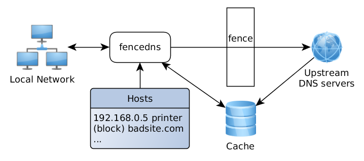

# fencedns

fencedns is a fast and small DNS server with ad-blocking capabilities.
It can be used as default DNS resolver on your system, blocking all attempts from any application to obtain IP addresses of advertisment domains.
The internal cache saves network traffic, the logs provide you with the information of what hosts were resolved and how much time it took, and an easy-to-use configuration file places **you** in control of your DNS traffic.

fencedns has a small memory and CPU usage - it saves the energy and the environment.

Contents:

* Features
* Algorithm
* Hosts
* Build
* Run
* Configure
* Refresh Hosts

## Features

* portable package without additional dependencies
* choose DNS upstream servers (currently, UDP only)
* block unwanted DNS names
* configure how to block them: with 127.0.0.1, 0.0.0.0 or NXDOMAIN, etc.
* rewrite DNS host to an IP address
* auto-refresh hosts from local files, if they are modified
* internal cache
* logs

Currently it runs only on Linux, but I plan to build it for Windows too.

## Algorithm

* DNS request comes from a client
* Search domain name in 'hosts' table configured by user
	If matched, respond either with an associated IP address, or block request according to the configuration.
* Search for a cached response to the request
	If found, reply with the cached response.
* Send request to an upstream server
* Receive response from an upstream server
* Add response to the cache
* Send response to the client

## Hosts

Hosts rewriting/blocking rules have this all-in-one syntax:

	# comment
	! comment
	([+]BASE_HOST)... # comment
	||BASE_HOST^
	IP EXACT_HOST...

You can use many different hosts files or a single one.
"domain->IP" rules have the highest priority.

Example:

	# some comment
	! another comment

	# block "block.host" and "block.host2" and all their subdomains
	block.host block.host2

	# unblock "dont.block.host" which was blocked by the previous line
	+dont.block.host

	# block "block.host3" and all its subdomains
	||block.host3^

	# respond with 127.0.0.1 IP address for "localhost" and "mycomputer",
	#  but not to "sub.localhost" or "sub.mycomputer"
	127.0.0.1 localhost mycomputer

## Build

You don't have to build it yourself - you may download an official binary from `Releases`.

	wget https://github.com/stsaz/fencedns/releases/download/v0.1/fencedns-0.1-linux-amd64.tar.xz
	tar xjf fencedns-0.1-linux-amd64.tar.xz
	cd fencedns-0

If you wish to build it yourself, follow these steps:

Requirements:

* git
* make
* gcc or clang

Build:

	git clone https://github.com/stsaz/ffbase
	git clone https://github.com/stsaz/ffos
	git clone https://github.com/stsaz/ff
	git clone https://github.com/stsaz/fencedns
	cd fencedns
	make install
	cd fencedns-0

## Run

You may run fencedns from your terminal window and stop it with Ctrl+C - as simple as that!

	sudo ./fencedns

You may also install it as a service so it will be automatically started when your computer boots up.

1. Download a list with the domains you want to block:

		wget https://adaway.org/hosts.txt

2. Install service (systemd):

		sudo ./fencedns --install

3. Start:

		sudo systemctl start fencedns

4. Set to auto-start with the system:

		sudo systemctl enable fencedns

5. Configure your system's default resolver to the IP address where fencedns is running.

Now the most DNS requsts will pass through fencedns and the advertisment domains will be blocked according to your hosts list.

## Configure

All configuration is stored in a simple text file, open it with your text editor:

	nano fencedns-0/fencedns.conf

After you made some changes, reload fencedns:

	sudo systemctl restart fencedns

## Refresh Hosts

The hosts files are often updated by their maintainers.
To update your local copy of hosts file, just re-download it:

	cd fencedns-0
	wget https://adaway.org/hosts.txt

After a minute fencedns will automatically refresh the hosts table.
